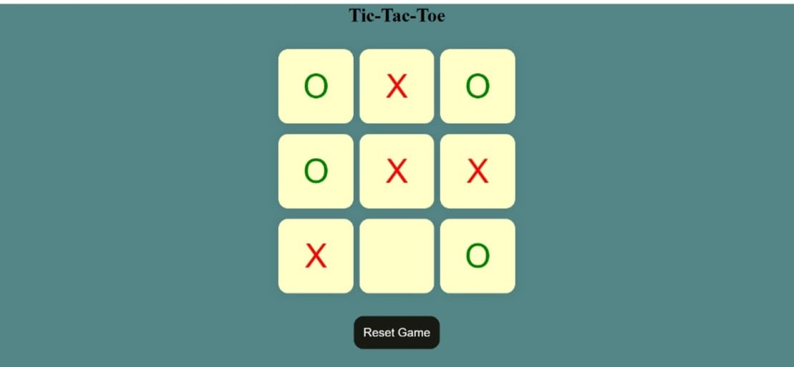
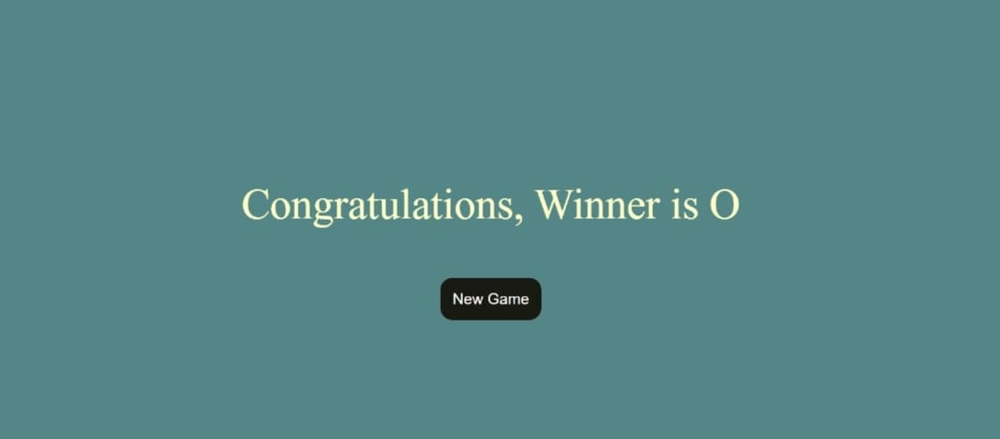

# 🎮 Tic Tac Toe Game

A classic Tic Tac Toe game built using **HTML**, **CSS**, and **JavaScript**. Challenge your friend or play solo — enjoy this lightweight, interactive, and clean UI game on your browser!

---

## 🧠 Features

- 🔥 2-Player Mode (X vs O)
- 🧠 Smart turn-based logic
- 💡 Highlights winner
- 🔄 Reset game functionality
- 🎨 Clean and responsive design

---

## 🚀 Live Demo

👉 [Play Now](https://github.com/Yogesh-Kumar-33/MINI-PROJECT/tree/main/TIC-TAC-TOE)  
(Replace the link with your actual deployed URL)

---

## 📸 Screenshots

| Game Start | Game Win |
|------------|----------|
|  |  |

_Add screenshots in a folder named `screenshots/` in your repo._

---

## 🛠️ Tech Stack

- **Frontend:** HTML, CSS, JavaScript
- **Deployment:** GitHub Pages

---

## 📂 Folder Structure
tic-tac-toe/
├── index.html
├── style.css
├── script.js
└── README.md

---

## 🧑‍💻 Author

- 👨‍💻 **Yogesh Kumar**
- 🎓 B.Tech CSE | UEM Jaipur | 5th Sem
- 🔗 [LinkedIn](https://www.linkedin.com/in/yogesh-kumar-2223b42a2/?trk=public-profile-join-page)  
- 🐱 [GitHub](https://github.com/Yogesh-Kumar-33/MINI-PROJECT)

---

## ❤️ Like this project?

Give it a ⭐ on GitHub — it motivates me to build more cool stuff!

