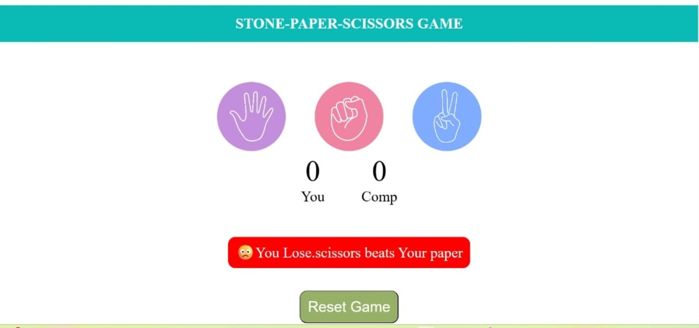
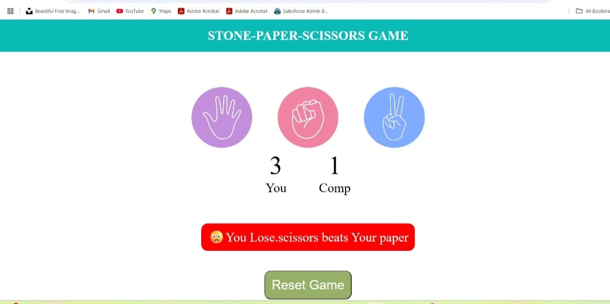
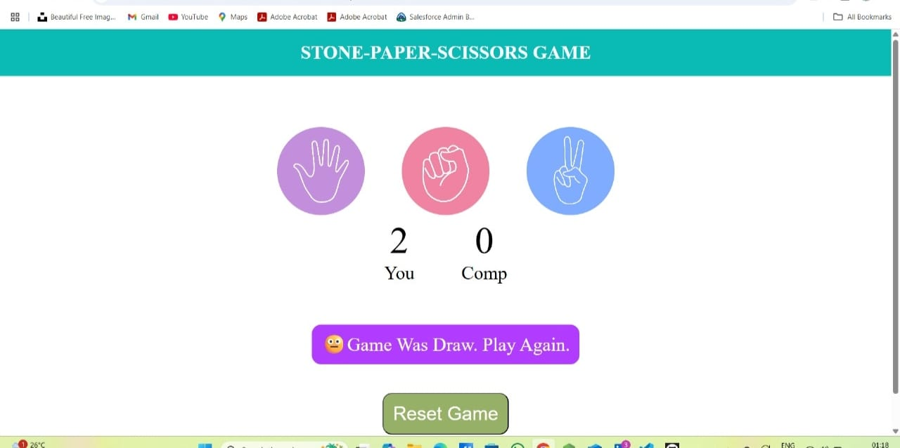

# ✊ Stone Paper Scissors Game 🖐️✌️

A fun and interactive **Stone-Paper-Scissors** game built with **HTML**, **CSS**, and **JavaScript**. Test your luck and logic against the computer in this simple yet addictive game!

---

## 🔥 Features

- 🧠 Play against computer (AI logic)
- 🕹️ Real-time score tracking
- 💥 Fast, responsive UI
- 🔁 Restart/Reset functionality
- 🎨 Clean and animated design

---

## 🚀 Live Demo

👉 [Play Now](https://github.com/Yogesh-Kumar-33/MINI-PROJECT/tree/main/STONE-PAPER-SCISSORS)  
_(Replace with your actual deployed URL)_

---

## 📸 Screenshots

| Game Start | Playing | Result |
|------------|---------|--------|
|  |  |  | 

---

## 🛠️ Tech Stack

- **Frontend:** HTML, CSS, JavaScript
- **Deployment:** GitHub Pages

---

## 📂 Folder Structure

stone-paper-scissors/
├── Stone-Paper-Scissors.html
├── Stone-Paper-Scissors.css
├── Stone-Paper-Scissors.js
├── README.md
└── /imgs/

---

## 🧑‍💻 Author

- 👨‍💻 **Yogesh Kumar**
- 🎓 B.Tech CSE | UEM Jaipur | 5th Semester
- 🔗 [LinkedIn](https://www.linkedin.com/in/yogesh-kumar-2223b42a2/?trk=public-profile-join-page)
- 🐱 [GitHub](https://github.com/Yogesh-Kumar-33/MINI-PROJECT)

---

## 🌟 Show Your Support

If you liked this project, please give it a ⭐ on GitHub and share it with your friends.  
It motivates me to keep building and learning! 🙌
